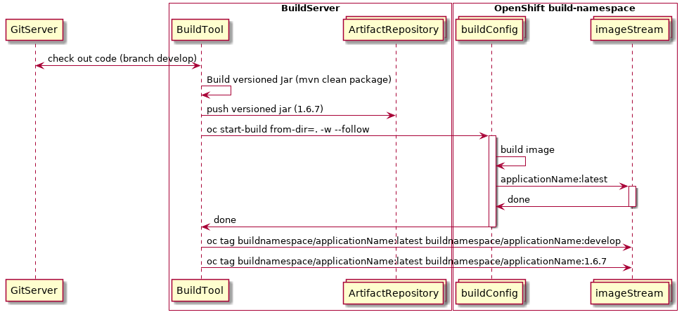

# fis2 generic buildtemplate

A simple re-usable template to use in build namespaces for Openshift for spring boot binary builds.  The only items created are:

- A BuildConfig, and
- An ImageStream

You may make modifications to the sections in `src/main/fabric8` as appropriate.  This project just uses the `raw` profile.

## How to use?

```
# build the template from the fragments
mvn clean package

# create a "build namespace"
oc new-project build-namespace

# create the template in the build namespace
oc create -f target/classes/META-INF/fabric8/openshift.yml
OR
oc create -f template.yml

# generate the objects from the template via "oc new-app"
oc new-app --template=fis2-generic-buildtemplate -p APPLICATION_NAME=my-app

# start a new build from the build config.  The build will expect a directory with a full-fat spring-boot jar in it
oc start-build my-app --from-dir=.

```

Once a build has complete you should now have an spring-boot docker image available in the imagestream, tagged as "latest".

Note that because the BuildConfig is marked as `Serial` that builds will not run in parallel.

It is recommended from this point to tag the image as something that better represents the binary embedded in the image, i.e.
- the branch of the code in git
- the actual version number of the jar
- both :)

Please see the below sequence diagram for a visual respresentation:




## Actual Template

```
apiVersion: v1
kind: Template
metadata:
  annotations:
    maven.fabric8.io/app-catalog: "true"
  name: fis2-generic-buildtemplate
objects:
- apiVersion: v1
  kind: ImageStream
  metadata:
    labels:
      group: com.nullendpoint
      project: ${APPLICATION_NAME}
      provider: fabric8
      version: "1.0"
    name: ${APPLICATION_NAME}
- apiVersion: v1
  kind: BuildConfig
  metadata:
    labels:
      group: com.nullendpoint
      project: ${APPLICATION_NAME}
      provider: fabric8
      version: "1.0"
    name: ${APPLICATION_NAME}
  spec:
    output:
      to:
        kind: ImageStreamTag
        name: ${APPLICATION_NAME}:latest
    postCommit: {}
    resources: {}
    runPolicy: Serial
    source:
      binary: {}
      type: Binary
    strategy:
      sourceStrategy:
        from:
          kind: ImageStreamTag
          name: fis-java-openshift:2.0
          namespace: openshift
      type: Source
parameters:
- description: The name for the application.
  name: APPLICATION_NAME
  required: true
```